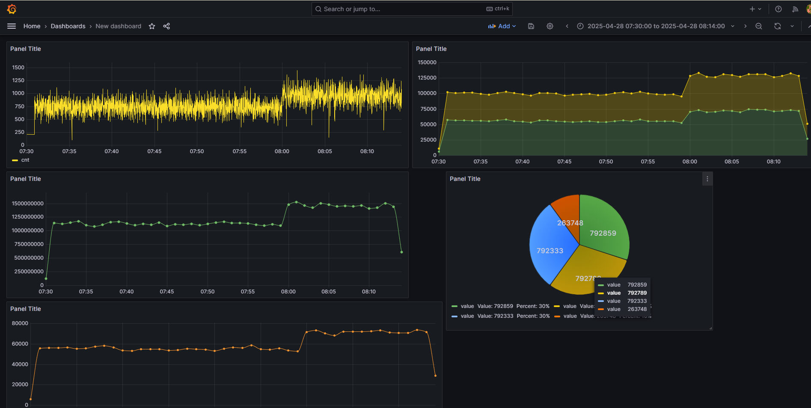
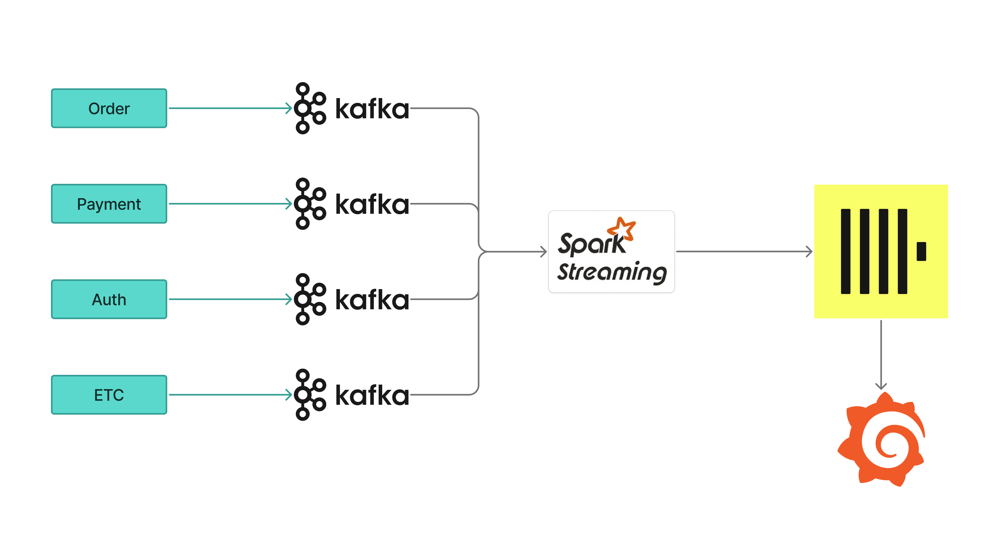

# Log Monitoring System

## 개요

**Log Monitoring System** 프로젝트는  
대규모 로그 데이터에 대한 **모니터링, 분석, 처리**를 목표로 하는 **PoC(Proof of Concept)**입니다.  

- 다양한 소스에서 발생하는 대량 로그를 실시간으로 수집, 전처리, 저장하는 체계를 검증했습니다.
- 시스템은 다양한 테스트 시나리오를 통해 확장성, 신뢰성, 처리 성능을 자유롭게 평가할 수 있도록 설계되었습니다.

## 특징
- **대규모 로그 처리에 최적화**:  
  수억 건 이상의 로그를 안정적으로 수집 및 분석하는 구조를 실험하고 검증했습니다.
  
- **유연한 테스트 가능**:  
  여러 형태의 로그, 다양한 부하 조건을 손쉽게 설정하여 PoC 검증 및 커스터마이징이 가능합니다.

- **모듈화된 설계**:  
  수집, 변환, 저장, 분석 단계가 명확히 분리되어 있어, 부분별 테스트 및 Cloud Migration이 용이합니다.

- **Docker Compose 기반 환경 제공**:  
  빠른 개발 및 테스트를 위해 필수 서비스(Kafka, Spark, ClickHouse 등)를 Docker Compose로 간편하게 실행할 수 있고 수직적인 성능 Customize가 가능합니다.

## 시스템 아키텍처

1. **로그 수집 (Producer)**  
   다양한 로그 소스를 시뮬레이션하여 Streaming API를 통해 Kafka로 전송합니다.

2. **로그 처리 (Spark Streaming)**  
   Kafka로부터 수신한 로그를 실시간으로 파싱하고, 분석을 위한 형태로 가공합니다.

3. **로그 저장 (ClickHouse)**  
   가공된 로그를 빠른 질의를 위해 ClickHouse에 저장합니다.

4. **시각화 및 모니터링 (Grafana, etc.)**  
   저장된 로그 데이터를 기반으로 대시보드를 구성하고 실시간 모니터링합니다.

## 사용 기술 스택
- **FastAPI**: Streaming API를 통한 실시간 로그 생성
- **Kafka**: 대규모 로그 메시지 스트리밍 처리
- **Spark Structured Streaming**: 실시간 데이터 파싱 및 가공
- **ClickHouse**: 초고속 OLAP 분석 데이터 저장소
- **Docker Compose**: 개발 및 테스트 환경 관리
- **Grafana**: 모니터링 및 시각화

## 테스트 가이드
- 다양한 크기와 형태의 로그를 생성하는 Log Simulator
- 여러 Source에서 데이터를 수집할 수 있도록 Kafka 조정
- Spark 처리 부하 조정
- ClickHouse 쿼리를 통한 분석 성능 측정 가능

## 주요 목표
- 대규모 로그 스트림을 실시간성을 고려해 안정적으로 처리할 수 있는지 검증
- 각 단계별 병목 지점 식별 및 개선 포인트 도출
- 다양한 테스트 케이스를 통해 시스템 확장성과 유연성, 충분히 필요한 기술스택인지 검증

## 향후 계획
- 더욱 복잡한 로그 포맷 대응
- On-premise, Cloud 등 다양한 배포 환경에서의 성능 측정
- 각 기능에 대한 Cloud 상품별 가격 비교 및 최적화

## 참고
- 본 프로젝트는 **PoC(Proof of Concept)** 목적이며,  
  실 서비스 환경 적용 시 별도 최적화 및 보안 구성이 필요합니다.